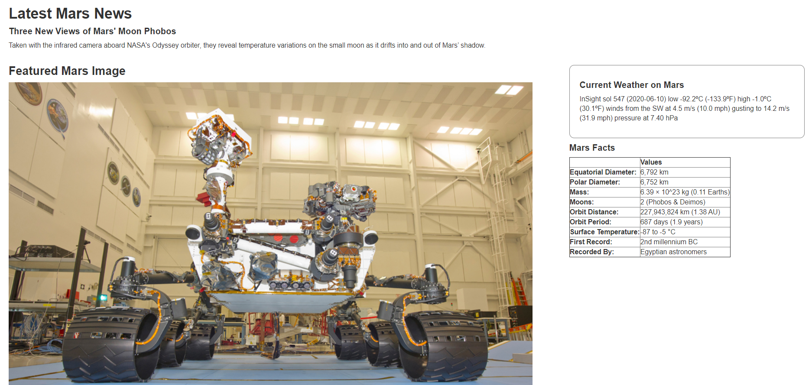
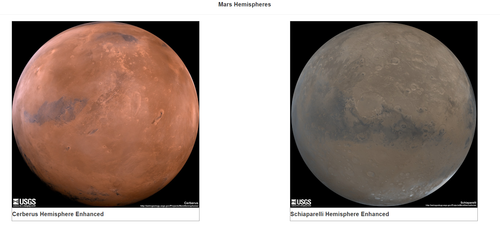
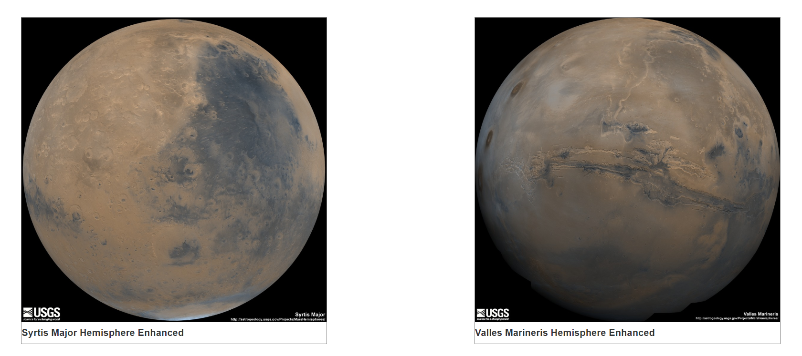

# Mission-to-Mars-with-web-scraping
The application created in this project scrapes 5 different websites for latest information on Mars and displays it on a HTML page.

## Narrative
1. Using beautiful soup and chromedriver, scraped 5 websites for relevant information, saved the same in a python file and created a function to automate the process.
2. In a flask application, used Pymongo to save the scraped information and created routes for home page and info page 
3. Created a HTML page and used jinja to obtain data from mongodb.  

## Tools and technologies used and required to run the project

* Python
    - Libraries:- PyMongo, BeautifulSoup, Time, Pandas, Splinter 
    - Jinja
    - Flask
* NoSQL- mongoDB
* Chromedriver and Chrome Browser
* HTML

## How to Run the Code

1. Make sure to have all the required tools installed on your system. Download the files app.py, scrape_mars.py and the templates folder

2. In the scrape_mars file, specify the path to your chrome driver or if you are a windows user, you can download the chromedriver from the repository and save it in the same folder as other files and in that case do not make any changes to the file.

3. Open terminal and go to the path where the files are saved on your computer

4. Type the commnad "flask run" and enter

5. Go to "localhost:5000" in your Chrome

6. A webpage will load, click on Scrape New Data button.
    - Note:- It will take few minutes to load the webpage due to an added functionality that lets the application run with lower internet bandwidths.

## Output

1. Mars weather for the day, latest news by NASA, featured image and facts

2. Mars hemispheres

